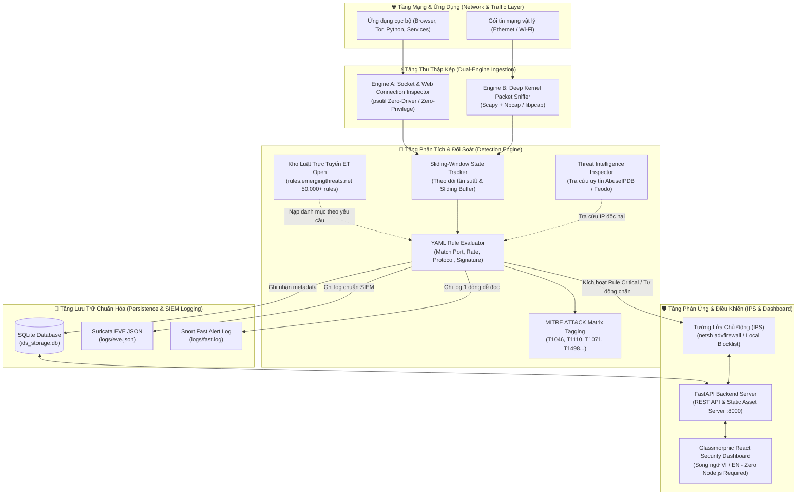
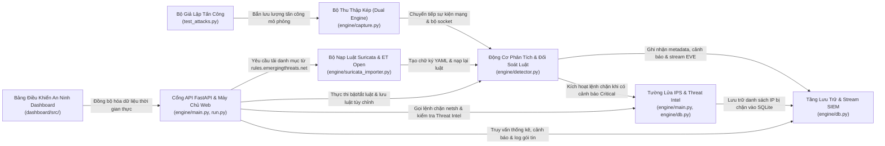
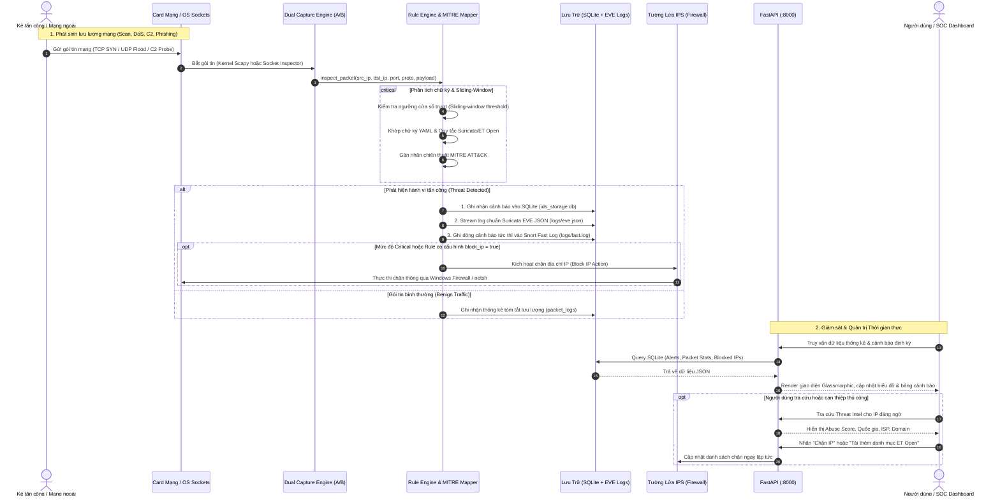

# 🛡️ Hệ Thống AegisGuard Personal IDS/IPS

[](https://python.org)
[](https://fastapi.tiangolo.com)
[](https://react.dev)
[](https://attack.mitre.org)
[](LICENSE)

**AegisGuard** là hệ thống **Phát hiện & Ngăn chặn Xâm nhập Mạng Cá nhân (Personal Network IDS/IPS)** đa nền tảng, gọn nhẹ và trực quan với bảng điều khiển giám sát an ninh thời gian thực phong cách Glassmorphism. Được thiết kế tối ưu riêng cho máy tính cá nhân (Windows, Linux, macOS), hệ thống mang lại khả năng phân tích gói tin tức thì, tùy biến luật phát hiện bằng YAML, tích hợp kho luật chính thức Emerging Threats (ET Open), tra cứu danh tiếng IP độc hại (Threat Intelligence) và tường lửa chủ động ngăn chặn kẻ tấn công.

---

## 🌟 Tính Năng Nổi Bật

- **⚡ Cơ Chế Thu Thập Kép (Dual-Engine Ingestion):**
  - **Engine A (Không cần Driver / Không cần quyền Admin):** Giám sát kết nối mạng ứng dụng và duyệt web HTTP/HTTPS bằng thư viện `psutil`, vận hành mượt mà, tiện lợi cho mọi người dùng.
  - **Engine B (Bộ Bắt Gói Tầng Nhân):** Phân tích sâu từng gói tin mạng thô ở tầng kernel qua `Scapy` + `Npcap/libpcap` khi chạy với quyền Administrator.
- **📏 Động Cơ Phân Tích Chữ Ký Linh Hoạt:** Định nghĩa chính sách phát hiện bằng cú pháp YAML dễ đọc, kết hợp thuật toán cửa sổ trượt (Sliding-Window) đánh giá tần suất theo thời gian thực (phát hiện Port Scan, Brute Force SSH/RDP, DoS Flood, C2 Tor/Metasploit, DNS Tunneling).
- **📥 Kho Luật Trực Tuyến Emerging Threats (ET Open):** Kết nối trực tiếp tới máy chủ `rules.emergingthreats.net` (hơn 50.000 rules) để tải và chuyển đổi các danh mục tấn công (Reconnaissance, DoS, CVE Exploits, Web Shell, Malware) chỉ với 1 cú nhấp chuột.
- **📝 Hệ Thống Lưu Trữ Phân Tầng Chuẩn Hóa SIEM:**
  - **SQLite Database (`ids_storage.db`):** Lưu trữ cục bộ tốc độ cao phục vụ truy vấn dữ liệu thời gian thực trên Dashboard.
  - **Suricata EVE JSON (`logs/eve.json`):** Định dạng chuẩn công nghiệp tương thích trực tiếp với **Wazuh, Splunk, Filebeat, ELK Stack**.
  - **Snort Fast Log (`logs/fast.log`):** Định dạng văn bản 1 dòng ngắn gọn, hỗ trợ mở xem tức thì qua Notepad hoặc lệnh `tail` trong Terminal.
- **🎨 Bảng Điều Khiển An Ninh Trực Quan (Glassmorphic Dashboard):** Được đóng gói sẵn tĩnh (Pre-built) và phân phối trực tiếp bởi FastAPI. Không yêu cầu người dùng phải cài đặt Node.js hay npm!
- **🌐 Giao Diện Song Ngữ (Tiếng Việt & Tiếng Anh):** Chuyển đổi ngôn ngữ linh hoạt chỉ với một cú nhấp và tự động ghi nhớ cấu hình.
- **🔍 Tích Hợp Threat Intelligence:** Tự động tra cứu độ uy tín và điểm rủi ro của IP (AbuseIPDB Score, Feodo Botnet C2, Quốc gia, ISP).
- **🚫 Tường Lửa Ngăn Chặn Chủ Động (Active IPS):** Chặn IP độc hại tự động theo cấu hình rule hoặc can thiệp chặn thủ công chỉ bằng 1 nút bấm (`netsh advfirewall`).
- **🛡️ Ánh Xạ Chiến Thuật MITRE ATT&CK:** Mọi cảnh báo đều được gắn thẻ kỹ thuật theo khung MITRE ATT&CK chuẩn quốc tế (`T1046`, `T1110`, `T1071`, `T1498`...).

---

## 🏗️ Kiến Trúc Hệ Thống

AegisGuard được thiết kế theo mô hình **Đa tầng (Multi-tier Architecture)** với cơ chế **Dual-Engine Ingestion**, tách biệt rõ ràng giữa tầng thu thập mạng, tầng phân tích chữ ký, tầng lưu trữ chuẩn SIEM và giao diện điều khiển.



---

### 🗺️ Bản Đồ Quan Hệ Giữa Các Module (Chuẩn CodeBoarding)

Kiến trúc các module được phân rã và chuẩn hóa theo tiêu chuẩn **[CodeBoarding](https://github.com/CodeBoarding/CodeBoarding)** (Phân tích mã nguồn tĩnh & Trích xuất quan hệ phụ thuộc kiến trúc). Tệp đặc tả cấu trúc đã được lưu tại [`.codeboarding/analysis.json`](.codeboarding/analysis.json):



---

## 🔄 Luồng Hoạt Động Tuần Tự Của Hệ Thống

Dưới đây là chu trình xử lý tuần tự từ lúc một gói tin hoặc luồng tấn công chạm vào máy tính cho đến khi hệ thống phân tích, lưu log chuẩn SIEM và chủ động thực thi chặn (IPS):



---

## 🛠️ Hướng Dẫn Cài Đặt & Khởi Chạy

Hệ thống hỗ trợ 2 chế độ triển khai: **Chạy ngay lập tức (Không cần cài đặt Node.js)** hoặc **Tự build từ Mã Nguồn (Dành cho Lập trình viên)**.

### Cách 1: Chạy ngay không cần Node.js (Khuyên dùng)
Giao diện React Dashboard đã được đóng gói sẵn thành các tệp tĩnh tối ưu trong thư mục `dashboard/dist/`. FastAPI sẽ tự động mount và phân phối bundle này.

```bash
# 1. Clone repository
git clone https://github.com/VDHieu0612/personal-idps.git
cd personal-idps

# 2. Cài đặt các thư viện Python cần thiết
pip install -r requirements.txt

# 3. Khởi chạy AegisGuard Engine & Dashboard
# (Trên Windows: Khuyên dùng Command Prompt / PowerShell quyền Administrator để kích hoạt Engine B)
# (Trên Linux/macOS: Chạy với quyền sudo)
python run.py
```
👉 Mở trình duyệt web và truy cập: **`http://localhost:8000`**

---

### Cách 2: Tự Build Frontend từ Mã Nguồn (Dành cho Lập trình viên)
Nếu bạn muốn chỉnh sửa giao diện React hoặc thêm component mới:

```bash
# 1. Di chuyển vào thư mục dashboard
cd dashboard

# 2. Cài đặt các dependencies
npm install

# 3. Chạy môi trường phát triển (Hot reload)
npm run dev

# 4. Khi hoàn tất, build lại bundle tĩnh vào dashboard/dist/
npm run build
```

---

## ⚙️ Hướng Dẫn Quản Trị Rules (Thêm, Xóa, Sửa, Bật/Tắt)

AegisGuard cho phép bạn quản lý chữ ký phát hiện qua **Giao diện Trực quan (Dashboard)** hoặc **Thao tác File Trực tiếp (YAML)**.

### 1. Thao tác trên Giao Diện Dashboard (Tab: Rule Catalog)
* **Bật / Tắt Rule (Toggle):**
  * Nhấp trực tiếp vào Checkbox bên cạnh mỗi Rule để kích hoạt hoặc tạm dừng.
  * Sử dụng nút **"Bật tất cả" (Enable All)** hoặc **"Tắt tất cả" (Disable All)** để áp dụng hàng loạt theo danh mục đang chọn.
* **Tạo Rule Mới bằng Trình Tạo Trực Quan (Rule Wizard):**
  1. Nhấn nút xanh **"Tạo luật tùy chỉnh" (Add Custom Rule)**.
  2. Điền thông tin:
     * **Tên quy tắc & Mô tả**: Ví dụ `Detect Custom Web Shell`.
     * **Danh mục & Mức độ**: `web_security`, `critical/high/medium/low`.
     * **Mô hình phát hiện (Pattern)**:
       * *Port Match*: Bắt lưu lượng trên các cổng cụ thể (ví dụ: `8080, 8443, 4444`).
       * *Single Target Connection Rate*: Phát hiện brute-force nếu số kết nối đến 1 cổng vượt quá ngưỡng trong khoảng thời gian (ví dụ: 10 lần trong 5 giây).
       * *Port Scan Threshold*: Phát hiện quét cổng nếu quét qua nhiều cổng khác nhau.
     * **Mã MITRE ATT&CK**: Gán mã tương ứng (ví dụ: `T1059`, `T1046`).
  3. Bấm **"Lưu & Kích hoạt quy tắc"** -> Hệ thống tạo file `.yml` và nạp vào Engine ngay lập tức.
* **Nạp Kho Luật Trực Tuyến Emerging Threats (ET Open):**
  1. Nhấn nút tím **"Nhập luật Suricata (.rules)"**.
  2. Tại mục *Chọn danh mục Emerging Threats*, chọn danh mục bạn muốn (Scan, DoS, CVE Exploits, Web Server, Worm, FTP...).
  3. Chọn số lượng rule muốn nạp (ví dụ 50 hoặc 100).
  4. Bấm **"Tải danh mục từ máy chủ ET Open"** -> Hệ thống tự động tải từ `rules.emergingthreats.net`, parse và đưa vào danh sách kiểm soát.

### 2. Thao tác Trực tiếp qua Tệp Cấu Hình YAML (`engine/rules/`)
Tất cả các rules được lưu dưới dạng file `.yml` trong thư mục `engine/rules/`.

* **Cấu trúc một file Rule mẫu (`engine/rules/custom_ssh_brute.yml`):**
```yaml
id: custom-ssh-brute
name: Potential SSH Brute Force Attack
description: Flags repeated connection attempts to SSH port 22.
severity: high
category: credential_access
enabled: true

condition:
  type: single_target_rate
  target_port: 22
  threshold_count: 5
  window_seconds: 10
  group_by: src_ip

action:
  alert: true
  block_ip: false

mitre_attack: T1110
tags:
  - ssh
  - brute_force
```

* **Thêm rule**: Tạo file mới có đuôi `.yml` trong `engine/rules/`.
* **Sửa rule**: Mở file `.yml` tương ứng, chỉnh sửa thông số cổng, ngưỡng hoặc hành động và lưu lại.
* **Xóa rule**: Xóa file `.yml` khỏi thư mục `engine/rules/`.
* *Lưu ý*: Engine tự động load lại danh sách rule khi bạn khởi động lại hoặc gọi API `/api/rules/toggle`.

---

## 📜 Hướng Dẫn Thao Tác Với Logs & Tích Hợp SIEM

AegisGuard thiết kế cơ chế lưu trữ phân tầng giúp bạn dễ dàng theo dõi trên máy cá nhân hoặc đẩy về hệ thống SOC tập trung.

### 1. Giám Sát Log Trực Tiếp Trên Web Dashboard
* **Trang Packets Stream**: Xem luồng gói tin và kết nối theo thời gian thực (TCP, UDP, ICMP, DNS, HTTP/HTTPS), hỗ trợ tìm kiếm theo IP và cổng.
* **Trang Recent Alerts**: Bảng tổng hợp các sự kiện vi phạm an ninh, nhãn mức độ nghiêm trọng, mã MITRE ATT&CK và nút **"Inspect IP"** tra cứu độ nguy hiểm (AbuseIPDB Score).
* **Trang IPS Blocklist**: Quản lý danh sách các IP đang bị chặn, xem lý do chặn và hỗ trợ gỡ chặn (Unblock) tức thì.

### 2. Truy Vấn Cơ Sở Dữ Liệu SQLite (`ids_storage.db`)
Cơ sở dữ liệu SQLite nằm tại thư mục gốc của dự án, lưu trữ toàn bộ dữ liệu có cấu trúc:
* Bảng `alerts`: Chi tiết các cuộc tấn công và vi phạm rule.
* Bảng `packet_logs`: Metadata của các gói tin mạng quét qua máy.
* Bảng `blocked_ips`: Danh sách các IP bị đưa vào tường lửa chặn.

**Ví dụ lệnh truy vấn nhanh qua CLI:**
```bash
# Xem 10 cảnh báo mới nhất
sqlite3 ids_storage.db "SELECT datetime(timestamp, 'unixepoch'), rule_name, severity, src_ip, dst_port FROM alerts ORDER BY timestamp DESC LIMIT 10;"

# Xem các IP bị phát hiện tấn công nhiều nhất
sqlite3 ids_storage.db "SELECT src_ip, COUNT(*) as attack_count FROM alerts GROUP BY src_ip ORDER BY attack_count DESC LIMIT 5;"

# Xem danh sách IP đang bị chặn trong Firewall
sqlite3 ids_storage.db "SELECT ip, reason, datetime(blocked_at, 'unixepoch') FROM blocked_ips;"
```

### 3. Tích Hợp SIEM qua Chuẩn Suricata EVE JSON (`logs/eve.json`)
Mỗi khi có cảnh báo xuất hiện, hệ thống đồng thời ghi một dòng JSON chuẩn công nghiệp vào tệp:
👉 `logs/eve.json`

```json
{"timestamp": "2026-10-02T15:28:45.000Z", "event_type": "alert", "src_ip": "185.220.101.5", "src_port": 54321, "dest_ip": "192.168.1.10", "dest_port": 22, "proto": "TCP", "alert": {"action": "alert", "signature_id": "rule-002", "signature": "SSH Brute Force Attempt", "category": "credential_access", "severity": "high", "mitre_attack": "T1110"}}
```

**Cách tích hợp với Wazuh Agent:**
Thêm đoạn sau vào file cấu hình `ossec.conf` của Wazuh Agent:
```xml
<localfile>
  <log_format>suricata</log_format>
  <location>D:\ĐACN\personal-ids\logs\eve.json</location>
</localfile>
```

### 4. Theo Dõi Nhanh Bằng Snort Fast Log (`logs/fast.log`)
Tệp log văn bản ngắn gọn, 1 dòng cho mỗi sự kiện:
👉 `logs/fast.log`

```text
10/02/2026-15:28:45  [**] [rule-002] SSH Brute Force Attempt [**] [Category: credential_access] [Priority: high] {TCP} 185.220.101.5:54321 -> 192.168.1.10:22
```

**Cách theo dõi trực tiếp trên PowerShell (tương tự `tail -f` trên Linux):**
```powershell
Get-Content logs/fast.log -Wait -Tail 20
```

---

## 🧪 Thử Nghiệm Kịch Bản Tấn Công (Demo trong 5 giây)

Để kiểm chứng khả năng phát hiện của IDS/IPS và xem các biểu đồ trên Dashboard phản hồi tức thì, mở một terminal thứ 2 và chạy:

```bash
# Chạy toàn bộ kịch bản tấn công mẫu (Port Scan, SSH/RDP Brute Force, DoS, C2, DNS Tunneling)
python test_attacks.py --all

# Hoặc mở menu tương tác để chọn từng bài test:
python test_attacks.py
```

---

## 💡 Cơ Sở Thiết Kế Kỹ Thuật (Tại sao chọn Signature + Threat Intel thay vì Flow ML)

Nhiều nghiên cứu học thuật về IDS thường sử dụng các bộ dữ liệu như **CICIDS2017** và phụ thuộc vào công cụ trích xuất **CICFlowMeter** (tính toán hơn 80 thuộc tính thống kê 2 chiều sau khi một luồng mạng đã kết thúc).

Trong môi trường triển khai thực tế trên máy tính cá nhân, việc chờ đợi kết thúc luồng (flow completion) gây ra độ trễ phát hiện rất lớn và tiêu tốn nhiều RAM/CPU. **AegisGuard** giải quyết triệt để vấn đề này bằng cách kết hợp:
1. **Phân tích theo gói tin và cửa sổ trượt thời gian thực (Sliding-window statistics)**: Phát hiện ngay khi tần suất vượt ngưỡng mà không cần đợi luồng kết thúc.
2. **Bộ chữ ký luật (Rule Signatures)**: Tương thích Suricata & ET Open giúp phát hiện chính xác với độ trễ gần bằng 0.
3. **Cơ chế Threat Intelligence Feeds**: Kiểm tra danh tiếng IP độc hại (AbuseIPDB/Feodo) ngay tại thời điểm kết nối.

---

## 📜 Giấy Phép (License)

Phát hành dưới giấy phép mã nguồn mở [MIT License](LICENSE).
